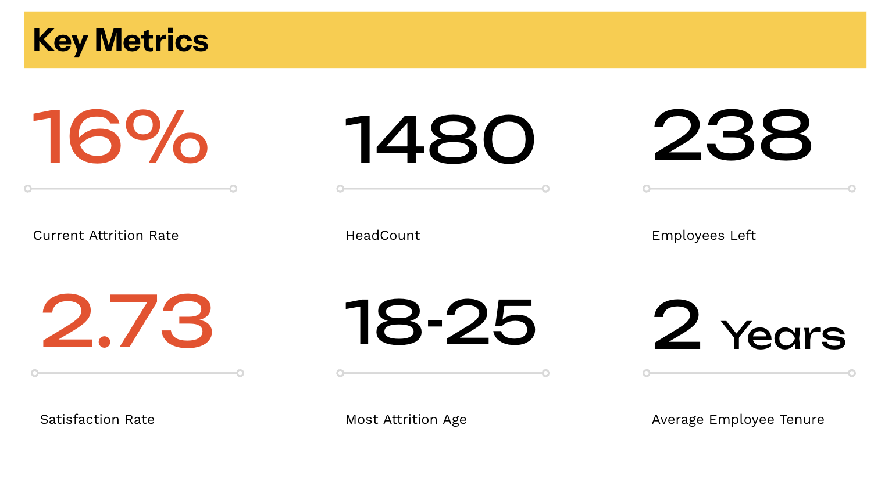
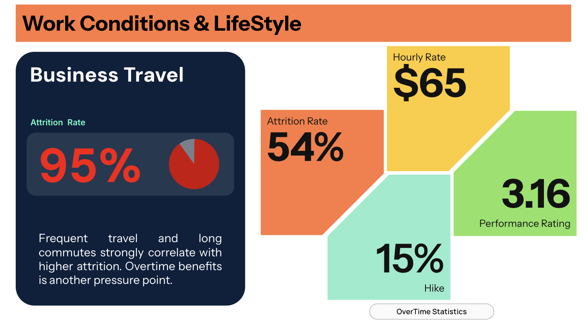
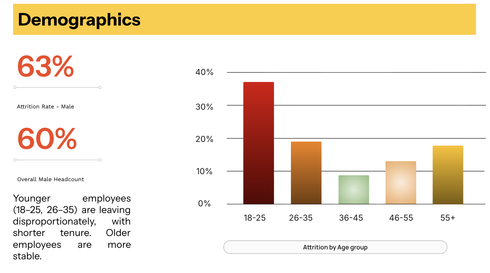
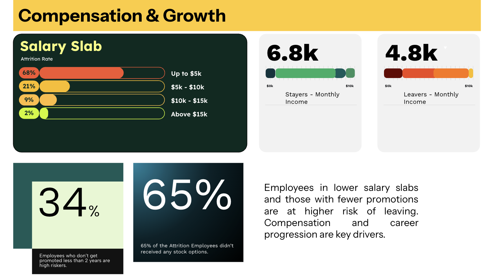

# HR Analytics: Employee Attrition Analysis

## Problem Statement

Employee attrition (turnover) is a major challenge for organizations, leading to high costs in recruitment, training, and lost productivity. The objective of this project is to analyze employee data to:

* Identify **who is leaving** (demographics, departments, job roles).
* Understand **why they are leaving** (compensation, travel, satisfaction, work-life balance).
* Provide **data-driven recommendations** to improve retention strategies.

---

## Dataset

The dataset contains anonymized employee records with attributes such as:

* **Demographics:** Age, Gender, Marital Status, Education, Education Field
* **Job & Work Factors:** Department, JobRole, BusinessTravel, DistanceFromHome, Overtime
* **Compensation:** MonthlyIncome, SalarySlab, StockOptionLevel, PercentSalaryHike
* **Engagement & Satisfaction:** JobSatisfaction, EnvironmentSatisfaction, RelationshipSatisfaction, WorkLifeBalance
* **Career Growth:** YearsAtCompany, YearsInCurrentRole, YearsSinceLastPromotion, TrainingTimesLastYear
* **Attrition:** Target variable (Yes/No)

Dataset source: [IBM HR Analytics Employee Attrition Dataset](https://www.kaggle.com/datasets/anshika2301/hr-analytics-dataset?select=HR_Analytics.csv)

---
## Executive Summary
The overall attrition rate stands at 16%, which is above industry benchmarks and signals a need for stronger retention strategies.

Key insights reveal that Sales (21%) and HR (19%) departments face the highest attrition, while Research & Development (14%) is relatively stable. 
Employees who travel frequently (95% attrition) are significantly more likely to leave compared to those with no travel (5%). 
Attrition is also disproportionately higher among younger employees (18–25, 26–35 age groups) and those in lower salary slabs (≤10k), suggesting challenges in retaining early-career and lower-compensated staff.
Further, employees who leave exhibit lower job satisfaction, weaker manager relationships, longer commute distances, and fewer or no stock option levels compared to those who stay. These patterns highlight the combined effects of compensation, career development, and work-life balance on retention.
Recommended Actions: 
Retention programs in Sales & HR Depts. 
Reduce travel burden (remote work or incentives).
Compensation review for early-career employees & Strengthen early engagement programs.
Expand stock options  and revamp benefits for overtime hours. 

---

## Key Visualizations 

---
## Key Insights
 

---
## Key Insights 

Current attrition rate is 16%, above industry benchmark.
Average employee tenure is just 2 years, showing short career cycles.

Sales (21%) and HR (19%) suffer the highest attrition.
Sales Representatives (24%) and HR Associates (23%), compared to more stable roles like Lab Technicians (14%).

Younger employees (18–35) are leaving disproportionately, with shorter tenures.
Attrition among males is higher (63%) compared to females.

Frequent travelers (95% attrition rate) and employees with long commutes are at much higher risk.
Overtime is another pressure point tied to attrition.

Employees in lower salary slabs (≤10k) show the highest attrition.
Average monthly income of leavers ($4.8k) is much lower than stayers ($6.8k).
34% of leavers had not been promoted within 2 years.
65% of attrition employees did not receive stock options, weakening retention incentives.
Employees who left reported lower job satisfaction (2.46 vs 2.78).

---
## Tools 

* Microsoft Excel → Data Cleaning & Validation.
* Tableau → Interactive dashboard.

---
## Recommendations - Next Steps

1. Target High-Attrition Departments (Sales & HR)
Launch focused retention initiatives in Sales & HR.
Introduce performance-linked incentives tailored for high-pressure roles.
2. Improve Early-Career Retention (18–35 Age Group)
Strengthen onboarding, mentorship, and career development programs.
Offer clear promotion pathways within the first 2–3 years.
Address low job satisfaction through employee feedback loops & manager coaching.
3. Review Compensation & Rewards
Adjust pay for employees in low salary slabs (≤10k) where attrition is highest.
Expand stock option/bonus programs to more employees including overtime hours benefits.
4. Reduce Travel-Related Burnout
For frequent travelers, Provide travel allowances, flexible schedules, or hybrid/remote options. And rotate travel responsibilities to prevent overload.

---

